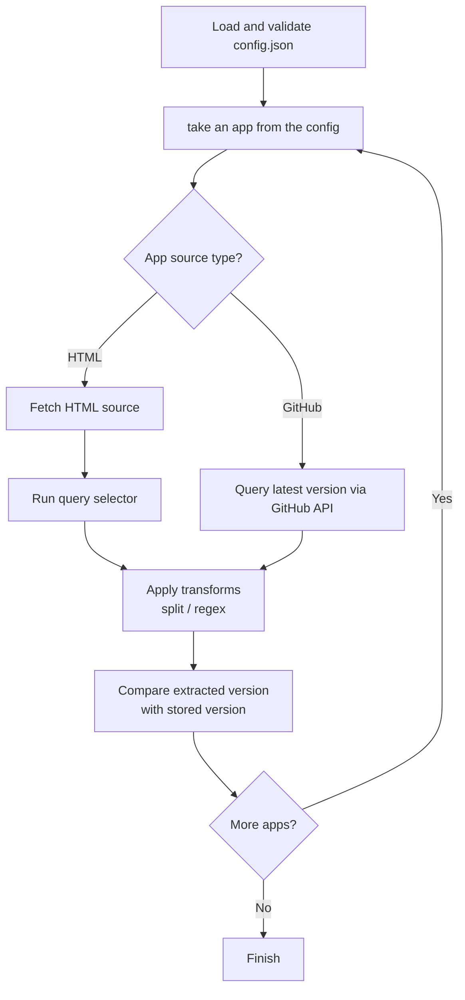

# Release Monitor

`release-monitor` is a lightweight CLI tool written in Go for checking updates of portable and manually managed software.

It compares versions stored in `config.json` with versions fetched from external sources such as GitHub Releases or HTML pages.

## How to Use

Here are all command-line options:

```bash
release-monitor --help
Usage of release-monitor:
  -c string
        short for --config (default "config.json")
  -config string
        path to config file (default "config.json")
  -github-token string
        GitHub access token
  -v    verbose output (to be done)
```

`-config` is optional if the configuration file is in the same folder.

### Example Output

```text
release-monitor -c path/to/sample/config.json
> AMAP: update available (0.30 → 0.34)
> AutoHotkey: update available (v2.0.19 → v2.0.24)
  Autoruns: up to date (v14.11)
  BalenaEtcher: up to date (v2.1.4)
> BleachBit: update available (v5.0.2 → v6.0.0)
```

### Configuring

Create a `config.json` file describing:

* application name
* installed version
* source type (github or html)
* optional transform pipeline

Example (see `config.json.example`):

```json
{
  "apps": [
    {
      "name": "AutoHotkey",
      "current": "v2.0.19",
      "source": {
        "type": "github",
        "github": {
          "repository": "AutoHotkey/AutoHotkey"
        }
      },
      "transform": [
        {
          "type": "regex",
          "params": [
            "v\\d+\\.\\d+\\.\\d+"
          ]
        }
      ]
    }
  ]
}
```

Both HTML and github sources return a string. In case of HTML a string is extracted using selector, in case of Github using Github API. This string can be fine-tuned later using transform pipeline.

#### HTML Source

HTML sources fetch text from a webpage and apply a CSS selector.

Example, that finds the HTML element of class "version", splits its text content using " ", and takes a third parameter:

```json
"source": {
  "type": "html",
  "html": {
    "url": "https://example.com/download",
    "selector": ".version"
  },
  "transform": [
    {
      "type": "split",
      "params": [" ", "3"]
    }
  ]
}
```

##### Finding a CSS Selector

You can find selectors using browser developer tools:

1. Open the page in your browser.
2. Right-click the version text.
3. Choose **Inspect**.
4. Find a stable class, id, or element, that is not auto-generated.
5. Build a selector.

Selector examples :

```text
.version
#download-version
div.release span
```

#### GitHub Source

GitHub source uses the latest release from the GitHub API.

Example:

```json
"source": {
  "type": "github",
  "github": {
    "repository": "owner/repo"
  }
}
```

GitHub API rate limits:

* anonymous requests: approximately 60 requests/hour
* authenticated requests: approximately 5000 requests/hour

If you monitor many repositories, you should provide a GitHub token.

Set it using the `GH_TOKEN` environment variable:

```bash
GH_TOKEN=your_token_here release-monitor -c config.json
```

PowerShell:

```powershell
$env:GH_TOKEN="your_token_here"
release-monitor -c config.json
```

#### Transform Pipeline

Regardless of the source type, you get a string that you might want to transform further. Transforms are applied sequentially.

Supported transforms:

* `regex` — extracts text matching a regular expression
* `split` — splits text and returns a specific element

Example:

```json
"transform": [
  {
    "type": "split",
    "params": [":", "2"]
  },
  {
    "type": "regex",
    "params": [
      "v\\d+\\.\\d+\\.\\d+"
    ]
  }
]
```

Let's say, we have the following text:

```text
Latest version: v1.2.3 released today
```

Transform pipeline can extract only the version:

```json
{
  "type": "regex",
  "params": [
    "v\\d+\\.\\d+\\.\\d+"
  ]
}
```

In this specific case we can also extract it with `split` transform:

```json
{
  "type": "split",
  "params": [" ", "3"]
}
```

One good thing is that in case of HTML source you can debug both selector and regex using just one command in the `console` tab of the browser dev tools:

```js
document.querySelector(".downloadtd").innerText.match(RegExp("\\d+.\\d+.\\d+"))
```

In case of Github source you can use online services like [regex101](https://regex101.com/)

## Development

### Internal Workflow



### Project Structure

```text
/app/app.go
/app/format.go
/app_context/context.go
/cmd/release-monitor/main.go
/cmd/release-monitor/config.json
/config/config.go
/config/validate.go
/model/model.go
/source/source.go
/source/github.go
/source/html.go
/transform/transform.go
/transform/regex.go
/transform/split.go
go.mod
```

### Build

```bash
go mod download
go build ./cmd/release-monitor
```

### Run Without Building

```bash
go run ./cmd/release-monitor
```

## License

MIT. See [LICENSE.txt](LICENSE.txt).
